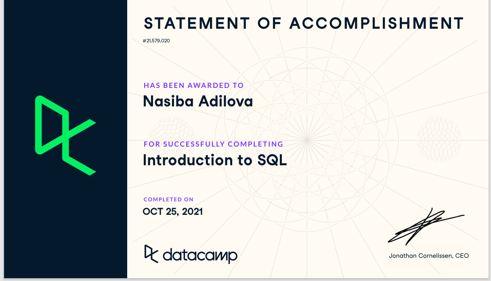

# week_6-homework

question:In the readme for the repo explain what an RDBMS is and what SQL is briefly (under 250 words)

We used to store data on paper in big filing cabinets. But eventually we store them online in what we call databases.How do we easily pull the data we want to look at it ? That is what SQL is for.  SQL stand for Structured Query Language. People call it SQL or Sequel. SQL is language to communicate with databases. if you want to pull,edit,add information in a database you can use the language of SQL to do that. SQL only speaks to a specific kind of database called a relational database which is essentially a database that has a tabular schema. Tabular schema means that database consists of interconnected table consisting of rows and columns.relational Database is database type that has tables with related data entries. Primary keys are used to connect the tables to each other. RDBMS stands for relational database management system and is the application that is used to work with (access and make changes to) the relational database. PostgreSQL is an example of RDBMS.

